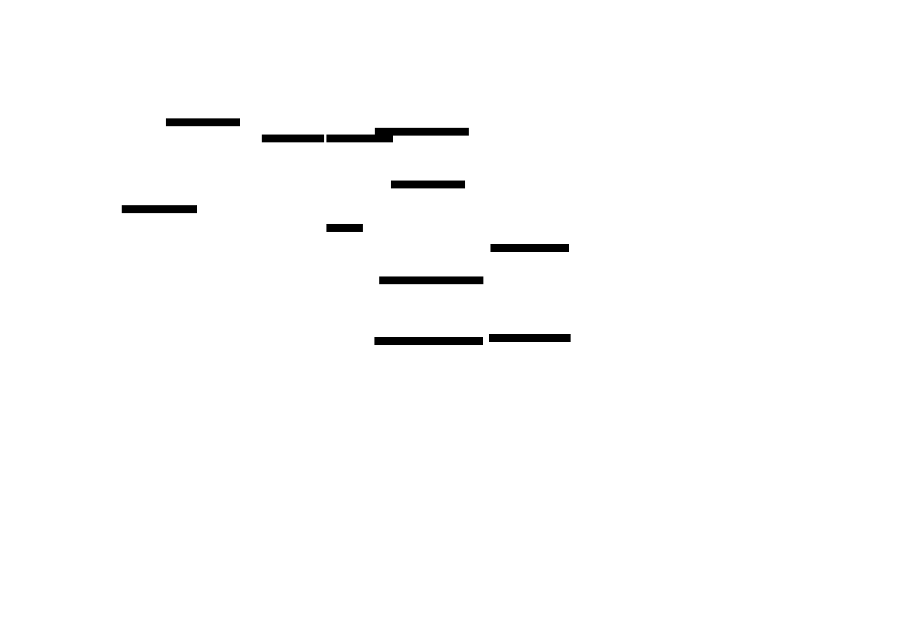

# 🍎 Caso: Análisis Inteligente de Productos Alimenticios mediante IA Generativa

## Descripción del caso

Una empresa desea desarrollar una aplicación móvil y web que permita a los usuarios conocer si un producto alimenticio es adecuado para su estado de salud simplemente **tomando una fotografía del envase** o **escaneando su código de barras**.

La aplicación debe identificar automáticamente el producto, obtener su información nutricional, analizar los ingredientes utilizando **Inteligencia Artificial Generativa** y entregar una recomendación personalizada según el perfil del usuario (edad, peso, enfermedades, alergias, objetivos nutricionales, etc.).

Toda la solución debe construirse utilizando **servicios serverless de AWS**, siguiendo una arquitectura desacoplada, escalable y de alta disponibilidad.

## Objetivo de la arquitectura

Construir una arquitectura AWS organizada en tres capas (**Front-End**, **API & Integration** y **Back-End Services**) donde el usuario pueda:

1. Capturar una fotografía del producto o escanear su código de barras.
2. Enviar la imagen mediante una API segura.
3. Procesar automáticamente la imagen.
4. Identificar el producto y extraer información relevante.
5. Consultar la base de datos nutricional.
6. Analizar el producto mediante IA Generativa.
7. Recibir una evaluación personalizada.
8. Guardar el historial de consultas.

---

## 🏗️ Arquitectura

:::tip[🔎 Diseño en profundidad — Lucidchart]
Este diagrama D2 documenta la arquitectura dentro del sitio. El diseño detallado y colaborativo (exploración de alternativas, anotaciones, ajuste fino del layout) vive en Lucidchart:

**[Abrir en Lucidchart →](https://lucid.app/lucidchart/2eef5bd9-e6a7-46ad-a794-a93983060c89/edit?invitationId=inv_d65f0203-a00b-4316-8f71-3ab6b3e2ee0c)**
:::

### LANE 1 — User Interface (Front-End)

**CLIENT APP (Mobile / Web)**

| Componente | Descripción |
|---|---|
| **Usuario** | Interactúa con la aplicación desde el móvil. |
| **Barcode Scanner** (JS / Native SDK) | Escanea el código de barras del producto para identificarlo rápidamente. Conecta hacia Amazon API Gateway. |
| **Food Image Upload** (Cámara) | Captura una fotografía del envase del alimento. La imagen se almacena inicialmente en Amazon S3. |
| **Amazon S3 — Raw Food Images** | Almacena las fotografías originales enviadas por el usuario antes del procesamiento. |

### LANE 2 — API & Integration

**API Layer**

| Componente | Descripción |
|---|---|
| **Amazon API Gateway** (REST / HTTP API) | Expone endpoints seguros para recibir imágenes, códigos de barras y solicitudes del cliente. |
| **AWS Lambda — Orchestrator** (Serverless Backend) | Orquestador principal: valida solicitudes, recibe imágenes, consulta DynamoDB, invoca Rekognition, invoca Bedrock y construye la respuesta final, guardando el historial. |

### LANE 3 — Back-End Services & Storage

**SERVICES**

| Componente | Descripción |
|---|---|
| **Amazon DynamoDB** (NoSQL Database) | Almacena productos, información nutricional, historial de consultas y perfil del usuario. |

**IMAGE PROCESSING**

| Componente | Descripción |
|---|---|
| **Amazon S3 — Raw Images** | Repositorio central de imágenes referenciado por el pipeline de procesamiento. |
| **Lambda — Image Processor** | Redimensiona, optimiza, valida el formato y prepara la imagen antes del análisis. |
| **Amazon Rekognition** (Image Recognition) | Detecta marca, producto, logotipos, texto visible y código de barras (si existe). El resultado se envía nuevamente a la Lambda orquestadora. |

**AI & INSIGHTS**

| Componente | Descripción |
|---|---|
| **Amazon Bedrock** (Generative AI) | Recibe información del producto, perfil del usuario y datos nutricionales. Genera evaluación nutricional, explicación del resultado, riesgos, beneficios, alternativas saludables y puntaje nutricional. |

---

## 🔄 Flujo de datos

1. El usuario escanea un código de barras o toma una foto del producto.
2. El **Barcode Scanner** envía el código directamente a **API Gateway**; la **Image Upload** sube la foto directamente a **S3 (Raw Food Images)**.
3. **API Gateway** invoca a la **Lambda Orchestrator**.
4. La Lambda guarda/recupera la imagen en **S3 (repositorio central)**, lo que dispara (evento `ObjectCreated`) a la **Lambda Image Processor**.
5. La Lambda Image Processor prepara la imagen y llama a **Amazon Rekognition**, que devuelve el reconocimiento del producto a la Lambda Orchestrator.
6. La Lambda Orchestrator consulta **DynamoDB** para obtener la información nutricional del producto y el perfil del usuario.
7. La Lambda Orchestrator envía el contexto (producto + perfil + datos nutricionales) a **Amazon Bedrock**, que genera la evaluación personalizada.
8. La Lambda Orchestrator guarda el resultado como historial en **DynamoDB**.
9. La respuesta final vuelve por **API Gateway** hacia el front-end.

### Leyenda

| Color | Tipo de flujo |
|---|---|
| 🟧 Naranja | **Data Flow** — datos de negocio (código de barras, resultados, prompts) |
| 🟦 Azul | **Image Flow** — la imagen del producto |
| ⬜ Gris | **Service Call** — invocación entre servicios (incluye consultas a base de datos) |
| 🟨 Amarillo | **Trigger** — evento que dispara una función automáticamente |

---

## 🧠 Notas de diseño

:::info[¿Por qué serverless?]
Ninguno de los componentes (API Gateway, Lambda, S3, DynamoDB, Rekognition, Bedrock) requiere aprovisionar ni administrar servidores. La arquitectura escala automáticamente con la demanda y el costo es proporcional al uso real — apropiado para una app cuyo tráfico es impredecible al lanzamiento.
:::

:::info[Desacoplamiento vía eventos]
El paso de **S3 → Lambda Image Processor** ocurre por evento (`Trigger`), no por invocación directa desde el orquestador. Esto separa la subida/almacenamiento de la imagen del procesamiento en sí, permitiendo que cada pieza escale y falle de forma independiente.
:::
