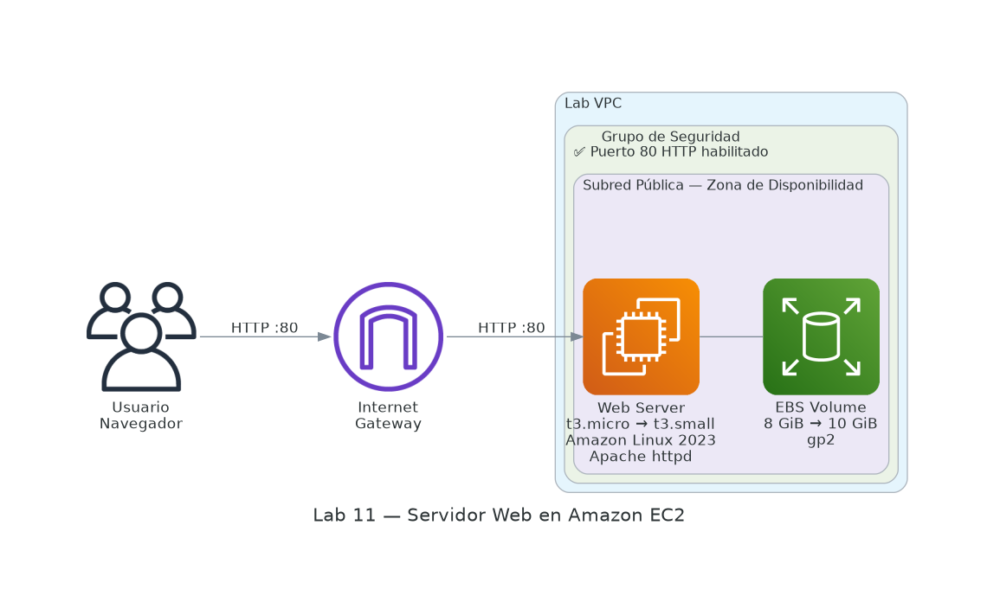

# 🖥️ Introducción a Amazon EC2

⏱️ **Tiempo estimado:** 45 minutos &nbsp;|&nbsp; 📊 **Nivel:** Básico &nbsp;|&nbsp; 🏷️ **Servicio:** Amazon EC2



Este laboratorio ofrece una visión general del lanzamiento, redimensionamiento, administración y monitorización de una instancia de Amazon EC2.

Amazon Elastic Compute Cloud (Amazon EC2) es un servicio web que proporciona capacidad de cómputo redimensionable en la nube. Está diseñado para facilitar a los desarrolladores la computación en la nube a escala web.

La interfaz web de Amazon EC2 permite obtener y configurar capacidad con mínimas complicaciones, con control total sobre los recursos informáticos y dentro del entorno de computación probado de Amazon. EC2 reduce el tiempo necesario para obtener e iniciar nuevas instancias de servidor a minutos, permitiendo escalar rápidamente la capacidad según cambien las necesidades de cómputo.

Amazon EC2 transforma la economía de la computación al permitir pagar solo por la capacidad que realmente se utiliza, y proporciona herramientas para crear aplicaciones tolerantes a fallos y aisladas de escenarios de fallo comunes.

---

## 🎯 Temas que se abordarán

Al finalizar este laboratorio, podrá:

- ✅ Iniciar un servidor web con protección contra terminación habilitada
- ✅ Supervisar su instancia EC2
- ✅ Modificar el grupo de seguridad para permitir el acceso HTTP
- ✅ Redimensionar su instancia de Amazon EC2 para escalarla
- ✅ Probar la protección contra terminación
- ✅ Terminar su instancia EC2

---

## 🏗️ Arquitectura del laboratorio

En este laboratorio construirá un <Term id="servidor_web">servidor web</Term> <Term id="apache">Apache</Term> sobre una <Term id="instancia">instancia EC2</Term> dentro de una <Term id="vpc">VPC</Term>. El diagrama anterior muestra el flujo completo: el usuario accede desde Internet a través del <Term id="puerto">puerto 80</Term>, controlado por un <Term id="grupo_seguridad">grupo de seguridad</Term>, hasta la instancia EC2 con su <Term id="ebs">volumen EBS</Term> adjunto.

Durante el laboratorio, la instancia evolucionará:
- Tipo: `t3.micro` → `t3.small`
- Almacenamiento: `8 GiB` → `10 GiB`

---

## 💡 Conceptos clave

:::info[🌐 VPC — Virtual Private Cloud]
Red virtual privada e aislada dentro de AWS donde se despliegan los recursos. Controla el direccionamiento IP, las subredes y las reglas de enrutamiento. En este laboratorio se utilizará la **Lab VPC**.
:::

:::info[🛡️ Grupo de seguridad]
Firewall virtual a nivel de instancia que define qué tráfico (protocolo, puerto, origen/destino) puede entrar o salir. Las reglas se aplican automáticamente a todas las instancias asociadas.
:::

:::info[📀 AMI — Amazon Machine Image]
Plantilla que contiene el sistema operativo y el software preinstalado necesario para lanzar una instancia. Incluye permisos de lanzamiento y la asignación de dispositivos de almacenamiento.
:::

---

## Tarea 1: Lanzar una instancia EC2

En esta tarea, lanzará una instancia de Amazon EC2 con _protección contra terminación_. La protección de terminación evita que se finalice accidentalmente una instancia EC2. Se implementará con un script de datos de usuario para desplegar un servidor web simple.

- En la Consola de administración de AWS, en el menú **Servicios**, elija **EC2**.


- En el panel de navegación izquierdo, elija **Panel EC2** para asegurarse de estar en la página del panel.


- Elija **Iniciar instancia** y luego seleccione **Iniciar instancia**.


### Paso 1: Nombrar su instancia EC2

Cuando se asigna un nombre a la instancia, AWS crea un par clave-valor. La clave para este par es **Nombre** y el valor es el nombre que se ingresa.

- En el panel **Nombre y etiquetas**, en el cuadro de texto **Nombre**, ingrese `Web Server`.


### Paso 2: Elegir una imagen de máquina de Amazon (AMI)

Una AMI proporciona la información necesaria para lanzar una instancia. Incluye lo siguiente:

- Una plantilla para el volumen raíz de la instancia (sistema operativo o servidor de aplicaciones)
- Permisos de lanzamiento que controlan qué cuentas de AWS pueden usar la AMI
- Una asignación de dispositivo de bloque con los volúmenes que se adjuntarán al lanzar

La lista de **Inicio rápido** contiene las AMI más utilizadas. También puede crear su propia AMI o seleccionarla desde AWS Marketplace.

- Localice el panel **Imágenes de aplicación y sistema operativo (Amazon Machine Image)**.
- En **AMI**, observe que **Amazon Linux 2023** está seleccionada de forma predeterminada. Mantenga esta configuración.


### Paso 3: Elegir un tipo de instancia

Amazon EC2 ofrece tipos de instancias optimizados para distintos casos de uso, con combinaciones de CPU, memoria, almacenamiento y capacidad de red.

- Seleccione **t3.micro** en el menú desplegable. Este tipo de instancia tiene 2 vCPU y 1 GiB de memoria.

:::note
Es posible que no pueda utilizar otros tipos de instancias en esta práctica de laboratorio.
:::


### Paso 4: Configurar un par de claves

Amazon EC2 utiliza criptografía de clave pública para cifrar y descifrar la información de inicio de sesión.

En esta práctica de laboratorio no se iniciará sesión en la instancia, por lo que no se necesita un par de claves.

- En el panel **Par de claves (iniciar sesión)**, seleccione **Continuar sin un par de claves (no recomendado)**.


### Paso 5: Configurar los ajustes de red

La **VPC** indica en qué nube privada virtual desea iniciar la instancia.

- En el panel **Configuración de red**, elija **Editar**.
- Para **VPC - required**, seleccione **Lab VPC**.


Aún en el panel **Configuración de red**, configure el grupo de seguridad:

- **Nombre del grupo de seguridad:** `Web Server security group`


- **Descripción:** `Security group for my web server`


:::info[🛡️ ¿Qué hace un grupo de seguridad?]
Un _grupo de seguridad_ actúa como <Term id="firewall">firewall virtual</Term> que controla el tráfico para una o más instancias. Se agregan _reglas_ a cada grupo que permiten el tráfico hacia o desde las instancias asociadas. Las nuevas reglas se aplican automáticamente a todas las instancias del grupo.
:::

En **Reglas de grupos de seguridad entrantes**, seleccione **Quitar**.

En esta práctica de laboratorio no se iniciará sesión mediante SSH. Eliminar el acceso SSH mejora la seguridad de la instancia.


### Paso 6: Agregar almacenamiento

Amazon EC2 almacena datos en un disco virtual conectado a la red llamado **Amazon Elastic Block Store (EBS)**.

La instancia EC2 se inicia con un volumen de disco predeterminado de **8 GiB** como volumen raíz (también conocido como volumen de inicio).

- En el panel **Configurar almacenamiento**, mantenga la configuración de almacenamiento predeterminada.


### Paso 7: Configurar detalles avanzados

- Expanda el panel **Detalles avanzados**.
- Seleccione el menú desplegable para **Protección contra terminación** y elija **Habilitar**.


Copie los siguientes comandos y péguelos en el cuadro de texto **Datos de usuario**:

```bash
#!/bin/bash
yum -y install httpd
systemctl enable httpd
systemctl start httpd
echo '<html><h1>Hello From Your Web Server!</h1></html>' > /var/www/html/index.html
```


Este script realiza las siguientes acciones al iniciar la instancia:

- Instala el <Term id="servidor_web">servidor web</Term> <Term id="apache">Apache</Term> (`httpd`)
- Configura Apache para que inicie automáticamente al arrancar
- Activa el servidor web
- Crea una página web de prueba en `/var/www/html/index.html`

### Paso 8: Lanzar la instancia EC2

Ahora que configuró todos los ajustes, es hora de iniciar la instancia.

- En el panel derecho, elija **Iniciar instancia**.


- Elija **Ver todas las instancias**.

La instancia aparece en estado **Pendiente**, lo que indica que se está lanzando. Luego cambia a **En ejecución** cuando ha comenzado a iniciarse.

La instancia recibe un nombre DNS público que puede utilizarse para comunicarse con ella desde Internet.

- Seleccione la casilla junto a **Servidor web**. La pestaña **Detalles** muestra información detallada.


- Revise la información en las pestañas **Detalles**, **Seguridad** y **Redes**.


Espere a que su instancia muestre:

:::tip[Actualice la consola si es necesario.]
- **Estado de instancia:** `En ejecución`
- **Comprobaciones de estado:** `2/2 comprobaciones aprobadas`
:::

---

## Tarea 2: Monitorear su instancia

El monitoreo es fundamental para mantener la confiabilidad, disponibilidad y rendimiento de las instancias EC2.

- Seleccione la instancia marcando la casilla y navegue hasta la pestaña **Verificaciones de estado**.

Con la supervisión del estado, puede determinar rápidamente si Amazon EC2 ha detectado algún problema que impida que sus instancias ejecuten aplicaciones. EC2 realiza comprobaciones automatizadas en cada instancia para identificar problemas de hardware y software.

Verifique que se hayan superado las comprobaciones de **Accesibilidad del sistema** y **Accesibilidad de la instancia**.

- Seleccione la pestaña **Monitoreo**.


Esta pestaña muestra las métricas de Amazon CloudWatch para su instancia. Actualmente no hay muchas métricas porque la instancia se lanzó recientemente. Puede elegir un gráfico para ver una vista ampliada.


Amazon EC2 envía métricas a Amazon CloudWatch para sus instancias. La **monitorización básica (5 minutos)** está habilitada de forma predeterminada. Puede habilitar el **seguimiento detallado (1 minuto)** si necesita mayor granularidad.

- En el menú **Acciones**, seleccione **Supervisar y solucionar problemas** → **Obtener captura de pantalla de instancia**.


Esto muestra cómo se vería la consola de la instancia EC2 si se le conectara una pantalla.


:::tip[💡 Utilidad de la captura de pantalla]
Si no puede acceder a su instancia a través de SSH o RDP, puede capturar una captura de pantalla y verla como imagen. Esto proporciona visibilidad del estado de la instancia y permite una resolución de problemas más rápida.
:::

- Seleccione **Cancelar** en la parte inferior de la captura de pantalla de la instancia.


<div className="felicitaciones">🎉🎉 ¡Felicitaciones! 🎉🎉</div>
Ha explorado varias formas de monitorear su instancia.

---

## Tarea 3: Actualizar el grupo de seguridad y acceder al servidor web

Cuando lanzó la instancia EC2, proporcionó un script que instaló un servidor web y creó una página simple. En esta tarea, accederá al contenido desde el servidor web.

- Seleccione la instancia marcando la casilla y elija la pestaña **Detalles**.


- Copie la **Dirección IPv4 pública** de su instancia al portapapeles.


- Abra una nueva pestaña en su navegador, pegue la dirección IP copiada y presione **Enter**.


**❓ Pregunta:** ¿Puede acceder a su servidor web? ¿Por qué no?

Actualmente **no** puede acceder al servidor web porque el _grupo de seguridad_ no permite el tráfico entrante en el <Term id="puerto">puerto 80</Term>, utilizado para solicitudes <Term id="http">HTTP</Term>. Esta es una demostración del uso de un grupo de seguridad como firewall para restringir el tráfico de red.

Para corregir esto, actualizará el grupo de seguridad para permitir tráfico web en el puerto 80.

- Mantenga abierta la pestaña del navegador y regrese a la **EC2 Management Console**.
- En el panel de navegación izquierdo, seleccione **Grupos de seguridad** en **Red y seguridad**.


- Seleccione **Grupo de seguridad del servidor web**.


- Seleccione la pestaña **Reglas de entrada**.


El grupo de seguridad actualmente no tiene reglas. Seleccione **Editar reglas de entrada** → **Agregar regla** y configure:

| Campo | Valor |
|-------|-------|
| **Tipo** | `HTTP` |
| **Fuente** | `Anywhere-IPv4` |


- Seleccione **Guardar reglas**.


- Regrese a la pestaña del servidor web abierta anteriormente y actualice la página.
- Debería ver el mensaje: **Hello From Your Web Server!**


<div className="felicitaciones">🎉🎉 ¡Felicitaciones! 🎉🎉</div>
Ha modificado exitosamente su grupo de seguridad para permitir el tráfico HTTP en su instancia Amazon EC2.

---

## Tarea 4: Cambiar el tamaño de su instancia

A medida que cambian las necesidades, puede descubrir que su instancia está sobreutilizada (muy pequeña) o infrautilizada (muy grande). Amazon EC2 permite cambiar el _tipo de instancia_ y el tamaño del disco sin necesidad de crear una nueva instancia.

### Detener la instancia

Antes de cambiar el tamaño de una instancia, debe _detenerla_.

:::note
Cuando se detiene una instancia, se cierra. **No** se aplica cargo por cómputo para una instancia detenida, pero sí se mantiene el cargo por almacenamiento de los volúmenes EBS adjuntos.
:::

- En **EC2 Management Console**, en el panel de navegación, seleccione **Instancias**.
- Seleccione la instancia marcando la casilla (**Servidor web** ya debería estar seleccionado).


- Seleccione **Estado de instancia** → **Detener instancia**.


- Seleccione **Detener**.

La instancia realizará un apagado normal y dejará de ejecutarse.


- Espere a que se muestre **Estado de instancia:** `Detenida`.


### Cambiar el tipo de instancia

- En el menú **Acciones**, seleccione **Configuración de instancia** → **Cambiar tipo de instancia** y configure:

| Campo | Valor |
|-------|-------|
| **Tipo de instancia** | `t3.small` |

- Elija **Cambiar tipo de instancia**.


:::note
Cuando la instancia se inicie nuevamente será `t3.small`, que tiene el doble de memoria que `t3.micro`. Es posible que no pueda utilizar otros tipos de instancias en esta práctica de laboratorio.
:::

### Cambiar el tamaño del volumen EBS

- En el menú de navegación, seleccione **Volúmenes** en **Elastic Block Store**.
- Seleccione el volumen marcando la casilla y en el menú **Acciones**, seleccione **Modificar volumen**.


El volumen tiene actualmente **8 GiB**. Ahora aumentará su tamaño.


- Cambie el tamaño a `10` GiB.

:::note
Es posible que no pueda crear volúmenes de gran tamaño en esta práctica de laboratorio.
:::


- Seleccione **Modificar** para confirmar y aumentar el tamaño del volumen.


### Iniciar la instancia redimensionada

Ahora volverá a iniciar la instancia, que tendrá más memoria y más espacio en disco.

- En el panel de navegación, seleccione **Instancias**.
- Seleccione **Servidor web** y navegue hasta **Estado de la instancia** → **Iniciar instancia**.


:::warning[⚠️ La IP pública cambia al reiniciar]
Al detener y volver a iniciar una instancia EC2, AWS asigna una **nueva <Term id="ip">dirección IP pública</Term>**. Si necesita una IP fija, debe utilizar una **Elastic IP Address (EIP)**.
:::


<div className="felicitaciones">🎉🎉 ¡Felicitaciones! 🎉🎉</div>
Ha cambiado correctamente el tamaño de su instancia Amazon EC2: de `t3.micro` a `t3.small`, y el volumen EBS de `8 GiB` a `10 GiB`.

---

## Tarea 5: Protección de terminación de prueba

Puede eliminar su instancia cuando ya no la necesite. Esto se conoce como _terminar_ la instancia. No puede conectarse ni reiniciar una instancia una vez finalizada.

- En el panel de navegación, seleccione **Instancias**.
- Seleccione la instancia **Servidor web** marcando la casilla.


- Navegue hasta el menú **Estado de la instancia** y seleccione **Terminar (eliminar) instancia**.


:::note
Aparecerá un mensaje indicando que al terminar una instancia respaldada por EBS, el volumen raíz se eliminará por defecto. Se le preguntará si está seguro de que desea finalizar la instancia.
:::


:::info[🔒 Protección contra terminación en acción]
Notará que la instancia **no se terminó** y aparece un mensaje de error: _No se pudo terminar una instancia: la instancia no puede terminarse._ Esto se debe a que tiene habilitada la protección de terminación.
:::


- En el menú **Acciones**, seleccione **Configuración de instancia** → **Cambiar protección contra terminación**.


- Desmarque la casilla **Habilitar** protección contra terminación y seleccione **Guardar**.


- En el menú **Acciones**, seleccione **Estado de instancia** → **Terminar instancia**.


- Seleccione **Terminar**.


<div className="felicitaciones">🎉🎉 ¡Felicitaciones! 🎉🎉</div>
Ha probado con éxito la protección contra terminación y finalizado su instancia.

---

## ✅ Laboratorio completo

1. Elija **Finalizar laboratorio** en la parte superior de esta página y seleccione **Sí** para confirmar.

   Un panel indica que se ha iniciado: _BORRAR... Puede cerrar este cuadro de mensaje ahora._

2. Se muestra el mensaje _Finalizó la práctica de laboratorio de AWS con éxito_, indicando que la práctica ha concluido.

---

## 🧠 ¿Qué aprendiste?

En este laboratorio practicaste los siguientes conceptos y habilidades clave de Amazon EC2:

| Concepto | Lo que hiciste |
|----------|----------------|
| **Lanzamiento de instancias** | Configuraste AMI, tipo de instancia, red y almacenamiento |
| **User Data** | Automatizaste la instalación de Apache httpd al iniciar |
| **Grupos de seguridad** | Controlaste el acceso HTTP por puerto como firewall virtual |
| **Monitoreo con CloudWatch** | Revisaste métricas y capturas de pantalla de la consola |
| **Escalado vertical** | Cambiaste de `t3.micro` a `t3.small` sin recrear la instancia |
| **Almacenamiento EBS** | Aumentaste el volumen raíz de `8 GiB` a `10 GiB` en caliente |
| **Protección de terminación** | Preveniste eliminaciones accidentales y aprendiste a deshabilitarla |
| **Ciclo de vida EC2** | Observaste los estados: Pendiente → En ejecución → Detenida → Terminada |

---

## 📝 Preguntas estilo examen Cloud Practitioner

Las siguientes preguntas tienen el formato y nivel de dificultad del examen **AWS Certified Cloud Practitioner (CLF-C02)**. Están basadas en los conceptos practicados en este laboratorio.

---

**1.** ¿Cuál es el estado inicial de una instancia EC2 inmediatamente después de iniciar su lanzamiento?

- A) En ejecución
- B) Pendiente
- C) Detenida
- D) Hibernando

---

**2.** ¿Qué describe mejor un **grupo de seguridad** en Amazon EC2?

- A) Un servicio de cifrado de datos en reposo
- B) Un firewall virtual que controla el tráfico entrante y saliente a nivel de instancia
- C) Un sistema de autenticación multifactor para la consola AWS
- D) Una política de IAM adjunta directamente a la instancia

---

**3.** ¿Qué ocurre con los datos almacenados en un volumen **Amazon EBS** cuando se _detiene_ una instancia EC2?

- A) Se eliminan automáticamente al detener la instancia
- B) Se archivan automáticamente en Amazon S3
- C) Persisten y están disponibles cuando la instancia se vuelve a iniciar
- D) Se replican automáticamente a otra zona de disponibilidad

---

**4.** ¿Para qué se utilizan los **datos de usuario (User Data)** en Amazon EC2?

- A) Para almacenar datos de la aplicación en el volumen EBS
- B) Para ejecutar scripts de configuración automática la primera vez que inicia la instancia
- C) Para definir los permisos de IAM de la instancia
- D) Para configurar las reglas del grupo de seguridad

---

**5.** ¿Qué ocurre con la **dirección IP pública** de una instancia EC2 cuando se detiene y se vuelve a iniciar?

- A) Permanece igual porque está vinculada a la instancia
- B) Se convierte en una dirección IP privada permanente
- C) Cambia a una nueva dirección IP pública
- D) Se elimina permanentemente y no puede recuperarse

---

**6.** Una empresa necesita evitar que sus instancias EC2 críticas sean eliminadas accidentalmente. ¿Qué característica de Amazon EC2 deben habilitar?

- A) Grupos de seguridad con reglas de denegación
- B) Protección contra terminación
- C) Elastic IP Address
- D) Monitoreo detallado de CloudWatch

---

**7.** Un administrador necesita cambiar el tipo de instancia de una EC2 de `t3.micro` a `t3.small`. ¿Qué debe hacer **antes** de realizar el cambio?

- A) Crear un snapshot del volumen EBS
- B) Detener la instancia
- C) Terminar la instancia y crear una nueva con el tipo deseado
- D) Deshabilitar el grupo de seguridad asociado

---

**8.** ¿Cuál es el **intervalo de monitoreo básico** predeterminado que Amazon CloudWatch ofrece para instancias EC2?

- A) 1 minuto
- B) 5 minutos
- C) 15 minutos
- D) 1 hora

---

**9.** ¿Cuál de las siguientes afirmaciones describe correctamente una **Amazon Machine Image (AMI)**?

- A) Es un tipo de almacenamiento de objetos para instancias EC2
- B) Es una plantilla que contiene el sistema operativo y la configuración necesaria para lanzar una instancia
- C) Es un servicio de monitoreo de rendimiento para instancias EC2
- D) Es una dirección IP fija asociada a una instancia EC2

---

**10.** ¿Cuál de las siguientes afirmaciones es correcta sobre la **facturación** de una instancia EC2 en estado _detenida_?

- A) No se cobra absolutamente nada cuando la instancia está detenida
- B) Se cobra únicamente el almacenamiento del volumen EBS asociado
- C) Se cobra la misma tarifa de cómputo que cuando está en ejecución
- D) Se cobra el 50% de la tarifa de ejecución como cargo de reserva

---

<details>
<summary>📋 Ver respuestas</summary>

| # | Respuesta | Explicación |
|---|-----------|-------------|
| 1 | **B) Pendiente** | Al lanzar una instancia, entra en estado *Pendiente* mientras AWS aprovisiona los recursos. Luego pasa a *En ejecución*. |
| 2 | **B) Firewall virtual** | Un grupo de seguridad actúa como firewall a nivel de instancia, controlando el tráfico de entrada y salida por protocolo, puerto y origen. |
| 3 | **C) Persisten** | Los volúmenes EBS son persistentes. Los datos se mantienen cuando la instancia se detiene y están disponibles al reiniciarla. |
| 4 | **B) Scripts de configuración al inicio** | User Data ejecuta scripts (bash, PowerShell) la primera vez que la instancia arranca, permitiendo configuración automática. |
| 5 | **C) Cambia a una nueva IP pública** | Las IPs públicas dinámicas son liberadas al detener la instancia. Al reiniciarla, AWS asigna una nueva. Para IP fija se usa Elastic IP. |
| 6 | **B) Protección contra terminación** | Esta característica impide la terminación accidental de instancias. Debe deshabilitarse explícitamente antes de poder terminar la instancia. |
| 7 | **B) Detener la instancia** | Para cambiar el tipo de instancia, primero debe estar detenida. No es necesario terminarla ni crear una nueva. |
| 8 | **B) 5 minutos** | La monitorización básica de CloudWatch para EC2 recopila métricas cada 5 minutos sin costo adicional. El monitoreo detallado (1 minuto) tiene costo extra. |
| 9 | **B) Plantilla con SO y configuración** | Una AMI es una plantilla que incluye el sistema operativo, software preinstalado, permisos de lanzamiento y configuración de almacenamiento. |
| 10 | **B) Solo el almacenamiento EBS** | Al detener una instancia, se deja de cobrar por cómputo (vCPU/RAM). Sin embargo, el almacenamiento EBS sigue facturándose. |

</details>

---

## 📚 Recursos adicionales

- [Lanzar su instancia](https://docs.aws.amazon.com/AWSEC2/latest/UserGuide/LaunchingAndUsingInstances.html)
- [Tipos de instancias de Amazon EC2](https://aws.amazon.com/ec2/instance-types)
- [Imágenes de máquinas de Amazon (AMI)](https://docs.aws.amazon.com/AWSEC2/latest/UserGuide/AMIs.html)
- [Amazon EC2: datos de usuario y scripts de Shell](https://docs.aws.amazon.com/AWSEC2/latest/UserGuide/user-data.html)
- [Volumen del dispositivo raíz de Amazon EC2](https://docs.aws.amazon.com/AWSEC2/latest/UserGuide/RootDeviceStorage.html)
- [Etiquetado de recursos de Amazon EC2](https://docs.aws.amazon.com/AWSEC2/latest/UserGuide/Using_Tags.html)
- [Grupos de seguridad](https://docs.aws.amazon.com/AWSEC2/latest/UserGuide/using-network-security.html)
- [Pares de claves de Amazon EC2](https://docs.aws.amazon.com/AWSEC2/latest/UserGuide/ec2-key-pairs.html)
- [Verificaciones de estado para sus instancias](https://docs.aws.amazon.com/AWSEC2/latest/UserGuide/monitoring-system-instance-status-check.html)
- [Obtener resultados de la consola y reiniciar instancias](https://docs.aws.amazon.com/AWSEC2/latest/UserGuide/instance-console.html)
- [Métricas y dimensiones de Amazon EC2](https://docs.aws.amazon.com/AmazonCloudWatch/latest/monitoring/ec2-metricscollected.html)
- [Cambiar el tamaño de su instancia](https://docs.aws.amazon.com/AWSEC2/latest/UserGuide/ec2-instance-resize.html)
- [Detener e iniciar su instancia](https://docs.aws.amazon.com/AWSEC2/latest/UserGuide/Stop_Start.html)
- [Terminar su instancia](https://docs.aws.amazon.com/AWSEC2/latest/UserGuide/terminating-instances.html)
- [Protección de terminación para una instancia](https://docs.aws.amazon.com/AWSEC2/latest/UserGuide/terminating-instances.html#Using_ChangingDisableAPITermination)
- [AWS Training and Certification](https://aws.amazon.com/training/)
