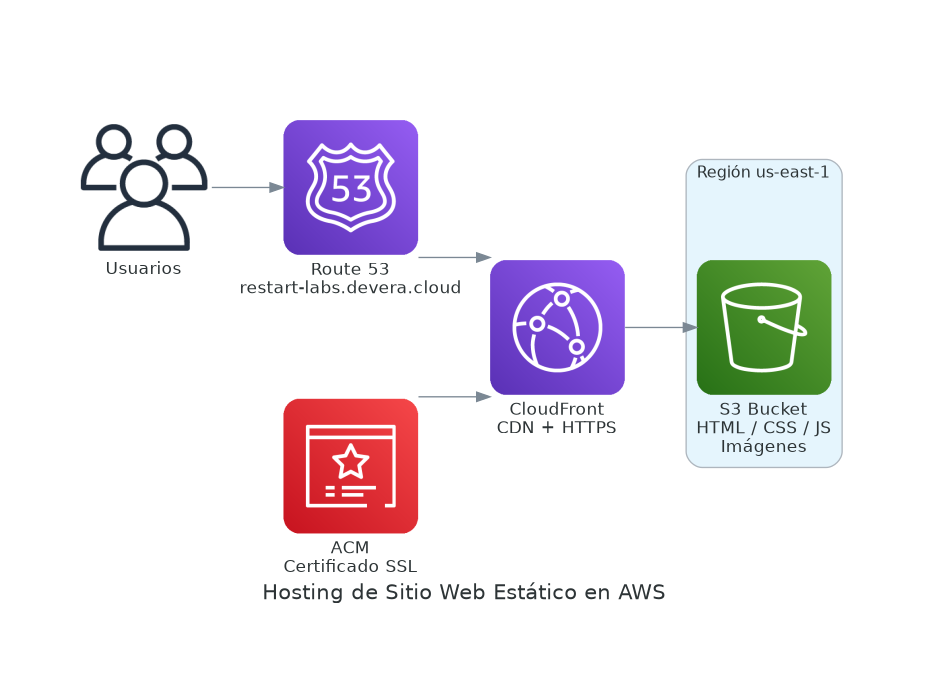

# Amazon S3 — Simple Storage Service

Amazon S3 es un servicio de **almacenamiento de objetos** con durabilidad del 99.999999999% (11 nueves). Diseñado para escalar desde gigabytes hasta exabytes sin configuración adicional.



## Conceptos clave

### Buckets
Contenedor de objetos. Reglas importantes:
- El nombre debe ser **único globalmente** en toda AWS
- Se crea en una región específica
- Máximo 100 buckets por cuenta (ampliable bajo solicitud)

### Objetos
Archivos almacenados dentro de un bucket. Cada objeto tiene:

| Componente | Descripción |
|------------|-------------|
| **Clave (Key)** | Ruta única: `carpeta/subcarpeta/archivo.txt` |
| **Valor (Value)** | Contenido del archivo (bytes) |
| **Metadata** | Pares clave-valor con información adicional |
| **Versión ID** | Si el versionado está activo |

> Tamaño máximo por objeto: **5 TB**. Para archivos > 100 MB se recomienda carga multiparte.

### Clases de almacenamiento

| Clase | Acceso | Caso de uso | Costo relativo |
|-------|--------|-------------|---------------|
| **S3 Standard** | Frecuente | Sitios web, apps activas | Alto |
| **S3 Standard-IA** | Poco frecuente | Backups, DR | Medio |
| **S3 One Zone-IA** | Poco frecuente | Datos recreables | Bajo |
| **S3 Glacier Instant** | Minutos | Archiving con acceso rápido | Muy bajo |
| **S3 Glacier Flexible** | Horas | Archiving largo plazo | Muy bajo |
| **S3 Glacier Deep Archive** | 12 horas | Cumplimiento, 7+ años | Mínimo |
| **S3 Intelligent-Tiering** | Variable | Patrones de acceso desconocidos | Automático |

## Características importantes

### Control de acceso
- **Bucket Policy:** Política JSON a nivel de bucket (recomendada)
- **IAM Policies:** Permisos a nivel de usuario/rol
- **ACL:** Control por objeto (legado, no recomendado)
- **Block Public Access:** Bloqueo global de acceso público — activo por defecto

### Versionado
Mantiene múltiples versiones del mismo objeto. Protege contra:
- Eliminaciones accidentales
- Sobreescrituras no deseadas

### Ciclo de vida (Lifecycle Rules)
Automatiza la transición entre clases de almacenamiento y la eliminación de objetos según su antigüedad.

```
Standard → Standard-IA (30 días) → Glacier (90 días) → Eliminar (365 días)
```

### Replicación
- **CRR (Cross-Region Replication):** Replica objetos entre regiones distintas
- **SRR (Same-Region Replication):** Replica dentro de la misma región

## Hosting de sitios estáticos
S3 puede servir directamente sitios web estáticos (HTML, CSS, JS, imágenes) sin servidor. Ideal combinado con **CloudFront** para distribución global y HTTPS.

## Casos de uso
- Almacenamiento de backups y archivos
- Hosting de sitios web estáticos
- Data lake para análisis con Athena o Redshift
- Almacenamiento de logs y registros de auditoría
- Distribución de contenido multimedia
- Origen para CloudFront CDN
