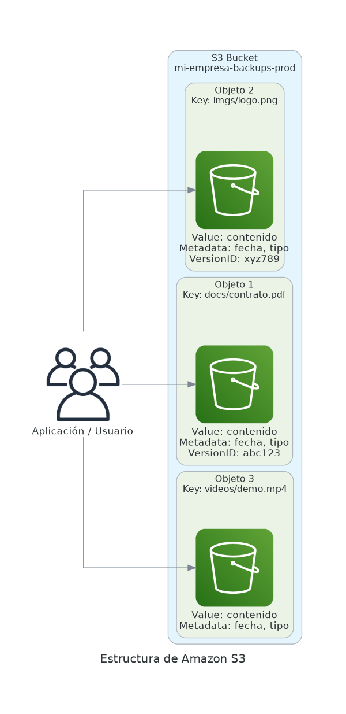
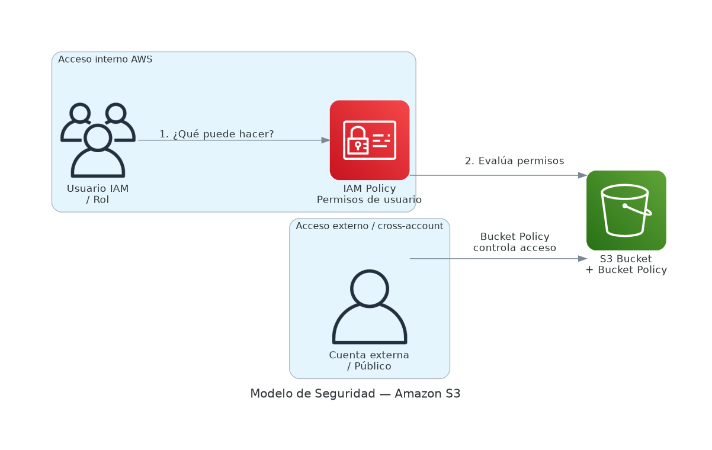

# 🗄️ Amazon S3 — Simple Storage Service

⏱️ **Tiempo de lectura estimado:** 20 minutos &nbsp;|&nbsp; 🏷️ **Relevancia:** AWS Cloud Practitioner CLF-C02

Amazon S3 es un servicio de almacenamiento de objetos con <Term id="durabilidad">durabilidad</Term> del **99.999999999% (11 nueves)**. Diseñado para escalar desde gigabytes hasta exabytes sin configuración adicional.



---

## 💡 Conceptos clave

:::info[⚖️ Durabilidad vs Disponibilidad]
- **<Term id="durabilidad">Durabilidad</Term>:** probabilidad de que el dato NO se pierda permanentemente → S3 Standard: **99.999999999%**
- **<Term id="disponibilidad">Disponibilidad</Term>:** porcentaje del tiempo que el servicio está accesible → S3 Standard: **99.99%**

Son conceptos distintos: un dato puede estar almacenado de forma durable pero temporalmente inaccesible.
:::

:::info[🗂️ Almacenamiento de objetos vs archivos]
A diferencia de los sistemas de archivos tradicionales (con carpetas y jerarquías), S3 usa una **estructura plana**. Cada archivo es un *objeto* con una clave única (Key). Lo que parece una carpeta es simplemente parte del nombre del objeto.
:::

---

## 🪣 Buckets

Un <Term id="bucket">bucket</Term> es el contenedor principal de S3. Todo objeto en S3 vive dentro de un bucket.

### Características
- Se crean dentro de una **región específica**
- Pueden contener millones de objetos
- El nombre es el identificador único global

### Reglas de nomenclatura

| Regla | Detalle |
|---|---|
| Solo minúsculas | No se permiten mayúsculas |
| Números y guiones | Sí permitidos |
| Longitud | 3–63 caracteres |
| Unicidad | **Globalmente único** en toda AWS |
| Sin formato IP | No puede ser una dirección IP |

```text
✅  mi-empresa-backups-prod
✅  datos-analytics-2026
❌  Mi_Empresa_Backups      (mayúsculas y guión bajo)
❌  192.168.1.1             (formato IP)
```

---

## 📦 Objetos

Un <Term id="objeto_s3">objeto</Term> es la unidad básica de almacenamiento en S3:

| Componente | Descripción |
|---|---|
| **Key** | Identificador único dentro del bucket (`docs/contrato.pdf`) |
| **Value** | El contenido del archivo (hasta **5 TB**) |
| **Metadata** | Pares clave-valor con información adicional |
| **Version ID** | Identificador de versión (si el versionado está activo) |

```text
s3://mi-bucket/documentos/contrato.pdf
               ↑_________________________↑
               Key = documentos/contrato.pdf
```

:::tip[📂 ¿Existen carpetas en S3?]
**No.** S3 es una estructura plana. Lo que parece una carpeta es simplemente el prefijo de la clave:

```text
imagenes/2026/producto1.jpg
```

La consola de AWS simula carpetas visualmente, pero internamente no existe jerarquía real.
:::

---

## 📋 Versionado

El versionado permite almacenar múltiples versiones del mismo objeto en el mismo bucket.

**Beneficios:**
- Recuperar archivos eliminados accidentalmente
- Restaurar versiones anteriores de un documento
- Protección ante errores humanos o automatizaciones mal configuradas

:::tip[🔐 Buenas prácticas para datos críticos]
- ✅ Activar **Versioning** en buckets con datos críticos
- ✅ Habilitar **MFA Delete** para requerir autenticación al eliminar versiones
- ✅ Aplicar principio de **mínimo privilegio** en las políticas IAM
- ✅ Configurar **Lifecycle Rules** para purgar versiones antiguas automáticamente
:::

---

## 🔐 Seguridad en Amazon S3



S3 aplica un **modelo de denegación por defecto**: todo acceso está bloqueado hasta que se otorgue explícitamente.

### IAM Policies

Controlan qué pueden hacer usuarios, grupos y roles de IAM sobre recursos S3:

| Acción | Permiso IAM |
|---|---|
| Leer objetos | `s3:GetObject` |
| Subir objetos | `s3:PutObject` |
| Eliminar objetos | `s3:DeleteObject` |
| Listar contenido | `s3:ListBucket` |

### Bucket Policies

Políticas JSON asociadas directamente al bucket. Permiten acceso a usuarios específicos, otras cuentas AWS o acceso público controlado:

```json
{
  "Version": "2012-10-17",
  "Statement": [
    {
      "Effect": "Allow",
      "Principal": "*",
      "Action": "s3:GetObject",
      "Resource": "arn:aws:s3:::mi-bucket-publico/*"
    }
  ]
}
```

### Comparación de mecanismos

| Mecanismo | Alcance | Uso típico |
|---|---|---|
| **IAM Policy** | Usuario / Rol | Acceso interno de recursos AWS |
| **Bucket Policy** | Bucket completo | Acceso cross-account o público controlado |
| **Block Public Access** | Cuenta o bucket | Protección contra exposición accidental |

:::warning[⚠️ Block Public Access activo por defecto]
AWS bloquea el acceso público en todos los buckets nuevos. Desactivarlo requiere confirmación explícita. Nunca lo desactives sin una justificación clara y documentada.
:::

---

## 📁 Clases de Almacenamiento

| Clase | Acceso | Disponibilidad | Caso de uso |
|---|---|---|---|
| **S3 Standard** | Frecuente | 99.99% | Aplicaciones activas, sitios web |
| **S3 Intelligent-Tiering** | Variable | 99.9% | Patrones de acceso desconocidos |
| **S3 Standard-IA** | Poco frecuente | 99.9% | Backups, datos consultados ocasionalmente |
| **S3 One Zone-IA** | Poco frecuente | 99.5% | Datos recreables, no críticos |
| **S3 Glacier Instant** | Archivado rápido | 99.9% | Archiving con recuperación en milisegundos |
| **S3 Glacier Flexible** | Archivado | 99.99% | Archivado largo plazo (minutos–horas) |
| **S3 Glacier Deep Archive** | Archivado máximo | 99.99% | Históricos, cumplimiento normativo (horas) |

:::tip[💡 Cuándo usar Intelligent-Tiering]
Si no sabes con qué frecuencia se accederá a un objeto, usa **Intelligent-Tiering**. Mueve automáticamente los objetos entre niveles según los patrones de uso, optimizando costos sin intervención manual.
:::

---

## ♻️ Reglas de Ciclo de Vida

Automatizan la transición entre clases y la eliminación de objetos:

```
Standard  →  Standard-IA (30 días)  →  Glacier Flexible (90 días)  →  Deep Archive (365 días)  →  Eliminar
```

---

## 🔁 Replicación

| Tipo | Descripción |
|---|---|
| **CRR** (Cross-Region Replication) | Replica objetos entre regiones distintas |
| **SRR** (Same-Region Replication) | Replica dentro de la misma región |

Requiere que el versionado esté activo en ambos buckets.

---

## 🌐 Hosting de Sitios Web Estáticos

S3 puede servir sitios web estáticos (HTML, CSS, JS, imágenes) directamente. Combinado con **CloudFront** y **ACM** proporciona HTTPS y distribución global sin servidor.

---

## 💰 Modelo de Costos

| Concepto | Descripción |
|---|---|
| **Almacenamiento** | GiB almacenados por mes |
| **Solicitudes** | PUT, GET, COPY, POST, LIST (por cantidad) |
| **Transferencia saliente** | Tráfico hacia Internet |
| **Recuperación** | Costo adicional en clases IA y Glacier |

:::note
La transferencia de datos entre S3 y servicios AWS dentro de la **misma región** es **gratuita**.
:::

---

## Casos de uso

- Backup y recuperación ante desastres
- <Term id="data_lake">Data Lake</Term> para análisis con Athena o Redshift
- Hosting de sitios web estáticos con CloudFront
- Almacenamiento de logs y registros de auditoría
- Distribución de contenido multimedia
- Artefactos de CI/CD y despliegues

---

## 🧠 ¿Qué aprendiste?

| Concepto | Resumen |
|---|---|
| **Bucket** | Contenedor único globalmente, creado en una región específica |
| **Objeto** | Archivo + Key + Metadata + VersionID (hasta 5 TB) |
| **Estructura plana** | No hay carpetas reales, solo prefijos en la Key |
| **11 nueves** | 99.999999999% de durabilidad — datos casi imposibles de perder |
| **Clases de almacenamiento** | Desde Standard (frecuente) hasta Deep Archive (económico, lento) |
| **Seguridad** | IAM Policy + Bucket Policy + Block Public Access |
| **Versionado** | Protege contra eliminaciones y sobreescrituras accidentales |
| **Lifecycle Rules** | Automatiza transición entre clases y eliminación |

---

## 📝 Preguntas estilo examen Cloud Practitioner

**1.** ¿Cuál es la durabilidad que Amazon S3 ofrece en S3 Standard?

- A) 99.9%
- B) 99.99%
- C) 99.999999999% (11 nueves)
- D) 100%

---

**2.** Una empresa almacena backups mensuales que rara vez necesita recuperar. ¿Qué clase de almacenamiento S3 optimiza mejor el costo?

- A) S3 Standard
- B) S3 Standard-IA
- C) S3 Intelligent-Tiering
- D) S3 One Zone-IA

---

**3.** ¿Cuál es el tamaño máximo de un objeto individual en Amazon S3?

- A) 1 GB
- B) 100 GB
- C) 1 TB
- D) 5 TB

---

**4.** Un equipo eliminó accidentalmente archivos importantes de un bucket S3. ¿Qué característica habría permitido recuperarlos?

- A) Replicación entre regiones (CRR)
- B) S3 Intelligent-Tiering
- C) Versionado (Versioning)
- D) Lifecycle Rules

---

**5.** ¿Cuál es la función de una Bucket Policy en Amazon S3?

- A) Definir qué usuarios IAM pueden acceder a la consola de AWS
- B) Controlar el acceso al bucket mediante una política JSON asociada directamente al bucket
- C) Cifrar automáticamente todos los objetos del bucket
- D) Configurar reglas de ciclo de vida para mover objetos entre clases

---

**6.** ¿Cuál de las siguientes afirmaciones sobre la estructura de Amazon S3 es correcta?

- A) S3 usa una estructura jerárquica de carpetas igual que un sistema de archivos
- B) S3 usa una estructura plana donde las "carpetas" son parte del nombre de la clave del objeto
- C) S3 organiza los objetos en tablas y filas como una base de datos
- D) S3 requiere que los objetos se organicen en carpetas para poder acceder a ellos

---

**7.** Una empresa necesita archivar registros contables por 7 años con el menor costo posible y solo los recuperará en caso de auditoría. ¿Qué clase de S3 es más adecuada?

- A) S3 Standard
- B) S3 Standard-IA
- C) S3 Glacier Instant Retrieval
- D) S3 Glacier Deep Archive

---

**8.** ¿Qué cobra Amazon S3 por la transferencia de datos entre S3 y una instancia EC2 en la misma región?

- A) Se cobra por GB transferido igual que hacia Internet
- B) Se cobra una tarifa reducida del 50%
- C) La transferencia es gratuita
- D) Solo se cobra si supera 1 TB al mes

---

<details>
<summary>📋 Ver respuestas</summary>

| # | Respuesta | Explicación |
|---|---|---|
| 1 | **C) 99.999999999%** | S3 replica los datos en múltiples AZs dentro de la región logrando 11 nueves de durabilidad. |
| 2 | **B) S3 Standard-IA** | Infrequent Access está diseñado para datos que se acceden con poca frecuencia pero deben estar disponibles rápidamente cuando se necesiten. |
| 3 | **D) 5 TB** | El límite máximo por objeto es 5 TB. Para archivos mayores de 100 MB, AWS recomienda carga multiparte. |
| 4 | **C) Versionado** | Con el versionado activo, los objetos "eliminados" reciben un marcador de eliminación pero siguen existiendo y pueden restaurarse. |
| 5 | **B) Política JSON en el bucket** | La Bucket Policy es un documento JSON que se adjunta al bucket y controla quién puede acceder y qué acciones puede realizar. |
| 6 | **B) Estructura plana con prefijos** | S3 no tiene carpetas reales. `imagenes/foto.jpg` es una clave donde `imagenes/` es solo un prefijo del nombre. |
| 7 | **D) S3 Glacier Deep Archive** | Es la clase más económica de S3, diseñada para datos que se conservan por años y que raramente se recuperan. |
| 8 | **C) Gratuita** | La transferencia entre S3 y servicios AWS en la misma región no tiene costo. Los costos aplican principalmente al tráfico hacia Internet. |

</details>
