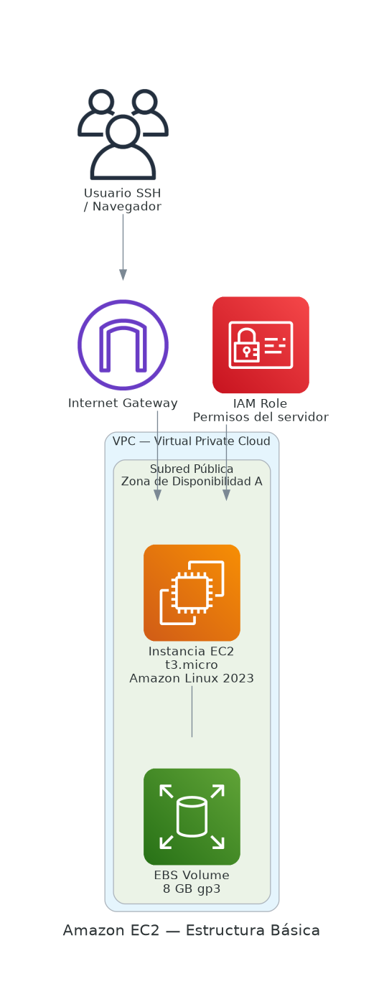

# Amazon EC2 — Elastic Compute Cloud

Amazon EC2 proporciona capacidad de cómputo escalable en la nube. Permite lanzar servidores virtuales en minutos, configurar seguridad y red, y pagar solo por lo que se usa.



## Conceptos clave

### AMI — Amazon Machine Image
Plantilla que contiene el sistema operativo y la configuración de software. Es el punto de partida para lanzar una instancia.

| AMI | Descripción |
|-----|-------------|
| Amazon Linux 2023 | Optimizada para AWS, mantenida por Amazon |
| Ubuntu | Popular para desarrollo y producción |
| Windows Server | Para cargas de trabajo Windows |

### Tipos de instancia
Clasificadas por familia según su caso de uso:

| Familia | Optimizada para | Ejemplo |
|---------|----------------|---------|
| **t** — General burstable | Cargas variables, desarrollo | t3.micro, t3.small |
| **m** — General balanceada | Balance CPU/RAM | m5.large |
| **c** — Cómputo intensivo | Alto procesamiento | c5.xlarge |
| **r** — Memoria intensiva | Gran RAM | r5.large |

> **Capa gratuita:** `t2.micro` o `t3.micro` — 750 horas/mes durante 12 meses.

### Par de claves (Key Pair)
Credencial SSH para acceder a la instancia. La clave privada se descarga **una sola vez** — si se pierde, no hay recuperación.

### Grupos de seguridad
Actúan como firewall virtual a nivel de instancia. Controlan tráfico entrante (inbound) y saliente (outbound) por protocolo, puerto e IP.

### Almacenamiento
| Tipo | Persistencia | Descripción |
|------|-------------|-------------|
| **EBS** | Permanente | Disco adjunto, sobrevive al reinicio |
| **Instance Store** | Temporal | Se elimina al detener la instancia |
| **EFS** | Permanente compartido | Sistema de archivos para múltiples instancias |

## Ciclo de vida de una instancia

```
Pendiente → En ejecución → Detenida → Terminada
```

| Estado | Facturación | Datos EBS |
|--------|------------|-----------|
| En ejecución | Sí (cómputo + almacenamiento) | Persisten |
| Detenida | Solo almacenamiento | Persisten |
| Terminada | No | Se eliminan (por defecto) |

## Opciones de compra

| Tipo | Ahorro | Caso de uso |
|------|--------|-------------|
| **On-Demand** | — | Cargas impredecibles |
| **Reserved** | hasta 72% | Cargas estables a 1–3 años |
| **Spot** | hasta 90% | Cargas tolerantes a interrupciones |
| **Savings Plans** | hasta 66% | Flexibilidad de familia/región |

## Casos de uso
- Servidores web y aplicaciones
- Entornos de desarrollo y prueba
- Procesamiento por lotes
- Aplicaciones empresariales con requisitos específicos de SO
