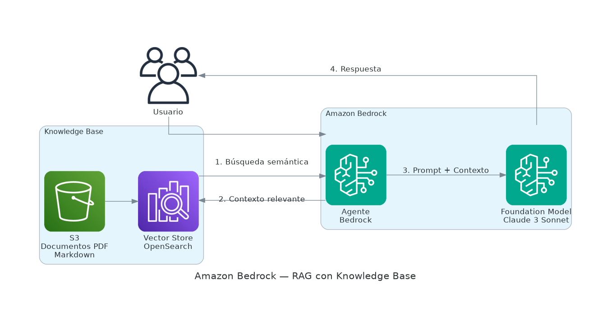

# Amazon Bedrock

Amazon Bedrock es un servicio administrado que ofrece acceso a **Foundation Models (FM)** de IA generativa de los principales proveedores, a través de una API unificada, sin gestionar infraestructura.



## ¿Qué son los Foundation Models?

Modelos de IA entrenados con enormes cantidades de datos que pueden adaptarse a múltiples tareas: generación de texto, imágenes, código, embeddings y más.

## Proveedores y modelos disponibles

| Proveedor | Modelos | Capacidades |
|-----------|---------|-------------|
| **Anthropic** | Claude 3 Haiku, Sonnet, Opus | Texto, análisis, código, visión |
| **Amazon** | Titan Text, Titan Embeddings | Texto, embeddings, imágenes |
| **Meta** | Llama 3 (8B, 70B) | Texto, código |
| **Mistral AI** | Mistral 7B, Mixtral 8x7B | Texto, multilingüe |
| **Stability AI** | Stable Diffusion XL | Generación de imágenes |
| **Cohere** | Command, Embed | Texto, embeddings empresariales |

## Conceptos clave

### Invocación de modelos
Se envía un prompt mediante API y se recibe la respuesta generada. Dos modos:
- **Síncrono:** respuesta completa de una vez
- **Streaming:** respuesta en tiempo real (token a token)

### Agentes de Bedrock
Permiten que el modelo ejecute tareas **multi-paso** de forma autónoma:
1. Recibe una instrucción en lenguaje natural
2. Planifica los pasos necesarios
3. Invoca herramientas y APIs externas
4. Entrega el resultado consolidado

### Knowledge Bases (RAG)
Conecta el modelo a **documentos propios** usando Retrieval Augmented Generation:

```
Pregunta del usuario
       ↓
Búsqueda semántica en documentos indexados
       ↓
Contexto relevante + Pregunta → Modelo → Respuesta fundamentada
```

Ideal para chatbots que deben responder sobre documentación interna.

### Guardrails
Filtros de seguridad configurables:
- Bloquear contenido inapropiado o dañino
- Restringir temas sensibles
- Redactar datos personales (PII)
- Evitar alucinaciones con grounding checks

### Fine-tuning
Permite ajustar un modelo base con datos propios para mejorar su comportamiento en tareas específicas del negocio.

## Comparación de modelos Claude 3

| Modelo | Velocidad | Capacidad | Caso de uso |
|--------|-----------|-----------|-------------|
| **Haiku** | Muy rápido | Básica | Tareas simples, alto volumen |
| **Sonnet** | Rápido | Alta | Balance ideal para producción |
| **Opus** | Más lento | Máxima | Tareas complejas de razonamiento |

## Modelo de precios
Se paga por **tokens** procesados (entrada + salida). No hay costo de infraestructura ni mínimos comprometidos.

## Casos de uso
- Asistentes conversacionales sobre documentación interna
- Generación y revisión de código
- Resumen y análisis de documentos extensos
- Búsqueda semántica sobre bases de conocimiento
- Generación de imágenes y contenido multimedia
- Automatización de flujos de trabajo con agentes IA
