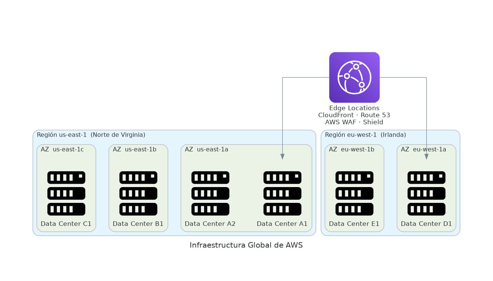

# 🌍 Infraestructura Global de AWS

⏱️ **Tiempo de lectura estimado:** 15 minutos &nbsp;|&nbsp; 🏷️ **Relevancia:** AWS Cloud Practitioner CLF-C02

La infraestructura global de AWS es la base física y lógica sobre la que se ejecutan todos sus servicios. Comprenderla es fundamental para diseñar aplicaciones resilientes, de baja latencia y conformes con requisitos regulatorios.

---

## 💡 Conceptos clave

:::info[🏢 Centros de Datos]
Instalaciones físicas donde AWS aloja servidores, almacenamiento, redes y equipamiento especializado. Cada uno opera con energía redundante, redes redundantes y alta seguridad física. Un solo centro de datos puede alojar decenas de miles de servidores.
:::

:::info[🏙️ Zona de Disponibilidad (AZ)]
<Term id="az">Conjunto de uno o más centros de datos</Term> físicamente separados dentro de una región. Diseñadas para aislamiento de fallos: un incendio, inundación o corte de energía en una AZ no afecta a las demás.
:::

:::info[🌎 Región AWS]
<Term id="region">Área geográfica independiente</Term> que agrupa múltiples AZ. Cada región opera de forma autónoma. Los datos no se mueven entre regiones salvo configuración explícita del usuario.
:::

:::info[⚡ Edge Location]
<Term id="edge_location">Punto de presencia distribuido globalmente</Term> utilizado por CloudFront, Route 53 y AWS WAF para entregar contenido con mínima <Term id="latencia">latencia</Term> al usuario final. Hay más de 400 en el mundo.
:::

---

## 🏢 Centros de Datos

Los centros de datos son la capa más fundamental de la infraestructura AWS. El usuario nunca interactúa directamente con ellos — AWS los abstrae mediante AZs y Regiones.

**Características:**
- Decenas de miles de servidores por instalación
- Energía redundante (múltiples proveedores + generadores)
- Redes redundantes con múltiples ISPs
- Alta seguridad física (biometría, guardias, sin señalización externa)
- Monitoreo permanente 24/7

---

## 🏙️ Zonas de Disponibilidad

Una AZ agrupa uno o más centros de datos cercanos entre sí, operando como una unidad lógica.

| Característica | Detalle |
|---|---|
| Separación física | Kilómetros de distancia entre AZs de la misma región |
| Conectividad | Redes privadas de fibra óptica de alta velocidad |
| Latencia entre AZs | Inferior a 1–2 ms |
| Identificación | `us-east-1a`, `us-east-1b`, `us-east-1c` |

### Buenas prácticas con AZs

:::tip[🏗️ Arquitectura multi-AZ]
AWS recomienda distribuir aplicaciones críticas en **al menos 2 AZs** para garantizar:
- **Alta disponibilidad:** si una AZ falla, la otra sigue operando
- **Recuperación ante fallos:** failover automático
- **Tolerancia a desastres locales:** incendios, inundaciones, cortes eléctricos
:::

---

## 🌎 Regiones AWS

Una Región es un área geográfica que contiene múltiples AZs. AWS tiene actualmente más de 30 regiones en producción a nivel mundial.

### Factores para elegir una Región

:::info[1️⃣ Cumplimiento normativo]
Algunos países o sectores exigen que los datos permanezcan dentro de ciertas jurisdicciones. Ejemplo: la GDPR europea exige que los datos de ciudadanos europeos no salgan de la UE.
:::

:::info[2️⃣ Latencia]
Mientras más cerca esté la región de los usuarios finales, menor será el tiempo de respuesta. Una aplicación para usuarios latinoamericanos puede beneficiarse de `sa-east-1` (São Paulo).
:::

:::info[3️⃣ Servicios disponibles]
No todos los servicios de AWS están disponibles en todas las regiones. Los nuevos servicios suelen lanzarse primero en `us-east-1` (Norte de Virginia) y luego se expanden.
:::

:::info[4️⃣ Costos]
Los precios varían entre regiones. La misma instancia EC2 puede costar diferente en `us-east-1` vs `ap-southeast-1`. Siempre verifica la tabla de precios de la región elegida.
:::

---

## ⚡ Edge Locations y Points of Presence

Las Edge Locations son centros de presencia distribuidos globalmente, distintos a las regiones y AZs. Su propósito es **acercar el contenido al usuario final**.

| Servicio | Uso de Edge Locations |
|---|---|
| **Amazon CloudFront** | CDN — caché de contenido estático y dinámico |
| **Route 53** | DNS global con baja latencia |
| **AWS WAF** | Firewall de aplicaciones web en el edge |
| **AWS Shield** | Protección DDoS global |
| **Lambda@Edge** | Funciones Lambda ejecutadas cerca del usuario |

:::tip[🌐 Diferencia clave]
Las **Regiones** alojan servicios completos (EC2, RDS, S3, etc.).
Las **Edge Locations** solo sirven contenido cacheado y procesan tráfico de red — no ejecutan cargas de trabajo completas.
:::

---

## 🧠 ¿Qué aprendiste?

| Concepto | Descripción resumida |
|---|---|
| **Centro de datos** | Instalación física con miles de servidores, red y energía redundante |
| **Zona de Disponibilidad** | Grupo de data centers aislados dentro de una región |
| **Región** | Área geográfica con múltiples AZs, autónoma e independiente |
| **Edge Location** | Punto de presencia global para baja latencia de contenido |
| **Factores de región** | Cumplimiento normativo, latencia, servicios disponibles, costos |
| **Multi-AZ** | Patrón de alta disponibilidad distribuyendo en 2+ AZs |

---

## 📝 Preguntas estilo examen Cloud Practitioner

**1.** ¿Cuántas Zonas de Disponibilidad tiene como mínimo una Región AWS?

- A) 1
- B) 2
- C) 3
- D) La cantidad varía, pero siempre hay al menos 2

---

**2.** Una empresa de servicios financieros en la Unión Europea debe garantizar que los datos de sus clientes no salgan del territorio europeo. ¿Cuál es el factor determinante al elegir una Región AWS?

- A) Latencia
- B) Costo
- C) Cumplimiento normativo
- D) Disponibilidad de servicios

---

**3.** ¿Cuál de las siguientes opciones describe correctamente una Zona de Disponibilidad (AZ)?

- A) Un continente donde AWS opera centros de datos
- B) Un conjunto de Regiones conectadas entre sí
- C) Uno o más centros de datos físicamente separados dentro de una Región
- D) Un punto de presencia global para distribución de contenido

---

**4.** ¿Qué servicio AWS utiliza principalmente las Edge Locations para distribuir contenido globalmente?

- A) Amazon EC2
- B) Amazon RDS
- C) Amazon CloudFront
- D) AWS Lambda

---

**5.** Un arquitecto necesita garantizar que una aplicación siga funcionando aunque falle un centro de datos completo. ¿Cuál es la estrategia correcta?

- A) Usar múltiples instancias EC2 en la misma AZ
- B) Desplegar la aplicación en múltiples AZs dentro de la misma región
- C) Aumentar el tamaño de la instancia EC2
- D) Activar Auto Scaling dentro de una sola AZ

---

**6.** ¿Qué ocurre con los datos almacenados en una Región AWS por defecto?

- A) Se replican automáticamente a todas las regiones
- B) Se replican a la región más cercana geográficamente
- C) Permanecen dentro de la región salvo configuración explícita del usuario
- D) Se distribuyen globalmente a través de Edge Locations

---

**7.** ¿Cuál de los siguientes NO es un factor recomendado por AWS para seleccionar una región?

- A) Latencia con los usuarios finales
- B) Cumplimiento normativo local
- C) El nombre de la región (código)
- D) Servicios disponibles en la región

---

**8.** Una startup lanza una aplicación para usuarios en América Latina. Desde el punto de vista de latencia, ¿cuál región sería más adecuada?

- A) us-east-1 (Norte de Virginia)
- B) eu-west-1 (Irlanda)
- C) sa-east-1 (São Paulo)
- D) ap-southeast-1 (Singapur)

---

📋 Ver respuestas

| # | Respuesta | Explicación |
|---|---|---|
| 1 | **D) Al menos 2** | AWS requiere mínimo 2 AZs por región, aunque la mayoría tiene 3 o más. |
| 2 | **C) Cumplimiento normativo** | La regulación GDPR y similares dictan dónde pueden residir los datos, sin importar el costo o la latencia. |
| 3 | **C) Uno o más data centers dentro de una Región** | Las AZs son unidades de aislamiento de fallos que agrupan data centers físicamente separados. |
| 4 | **C) Amazon CloudFront** | CloudFront es el CDN de AWS y usa Edge Locations para cachear y entregar contenido globalmente. |
| 5 | **B) Múltiples AZs** | Distribuir en varias AZs garantiza que un fallo en una no afecte la disponibilidad total. |
| 6 | **C) Permanecen en la región** | AWS garantiza soberanía de datos por región — no hay movimiento automático entre regiones. |
| 7 | **C) El nombre de la región** | El código de región (us-east-1, eu-west-1) no es un factor de decisión. Los factores son: latencia, cumplimiento, servicios y costos. |
| 8 | **C) sa-east-1 (São Paulo)** | Es la región más cercana geográficamente a América Latina, lo que minimiza la latencia. |

